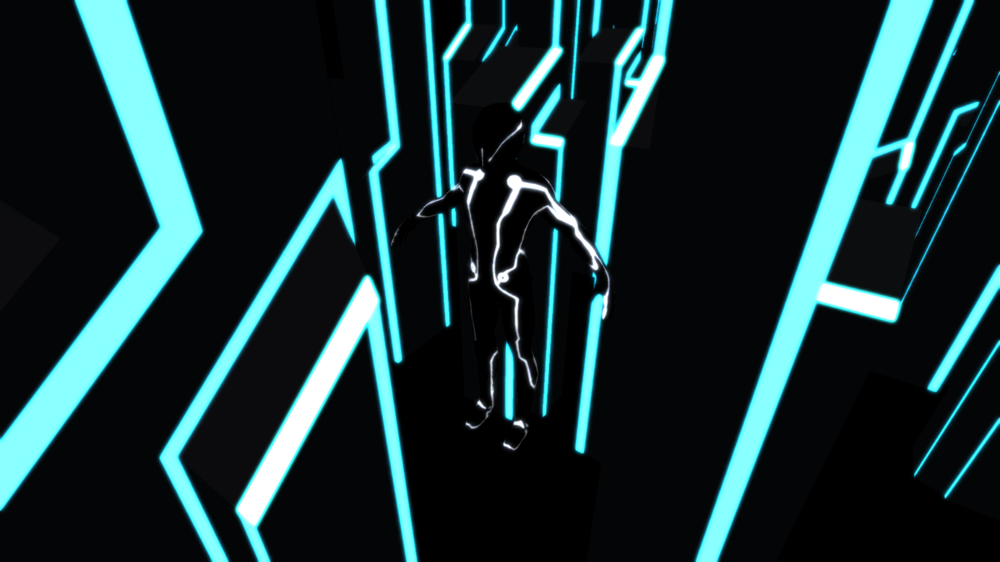
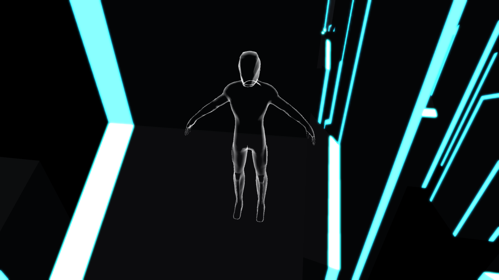

# Tron Scene with Bloom

A simple Tron scene created in Unity3D which uses a bloom filter and an X-Ray effect. Playable at https://peroshki.github.io/Tron-Scene-with-Bloom/

All of the shaders and scripts used in this project are included in the Assets foler.

## Screenshots

  <strong>Normal View:</strong>

  <strong>X-Ray View:</strong>

